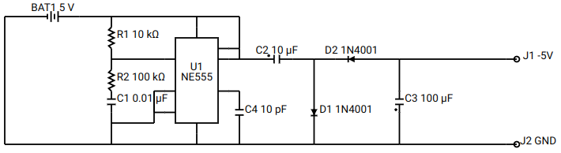
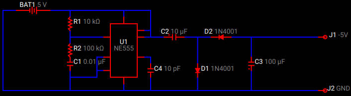

# Schemascii

[](https://github.com/dragoncoder047/schemascii/issues)


A command-line tool and library for converting ASCII-art diagrams into beautiful SVG circuit schematics.

Turn this:

```txt
*--BAT1+--*-------*---*
|         |       |   |
|         R1    .~~~. |
|         |     :   :-*
|         *-----:   :---+C2--*--D2+--*----------J1
|         |     :U1 :        |       |
|        R2     :555:        |       |
|         |   *-:   :-*      |       |
|         C1  | :   : |      +       C3
|         |   *-:   : C4     D1      +
|         *---* .~~~. |      |       |
|         |       |   |      |       |
*---------*-------*---*------*-------*----------J2

BAT1:5
R1:10k
R2:100k
C1:10000p
C2:10u
C3:100u
C4:10p
D1:1N4001
D2:1N4001
U1:NE555,7,6,2,1,5,3,4,8
J1:-5V
J2:GND
```

Into this:



And with a little CSS, this:



Works with Python 3.10+. It uses the new `match` feature in a few places. If you need to run Schemascii on an older version of Python, feel free to fork it and send me a pull request.

Command line usage:

```usage
usage: schemascii [-h] [-V] [-o OUT_FILE] [--padding PADDING] [--scale SCALE] [--stroke_width STROKE_WIDTH] [--stroke STROKE]
                  [--label {L,V,VL}]
                  in_file

Render ASCII-art schematics into SVG.

positional arguments:
  in_file               File to process.

options:
  -h, --help            show this help message and exit
  -V, --version         show program's version number and exit
  -o OUT_FILE, --out OUT_FILE
                        Output SVG file. (default input file plus .svg)
  --padding PADDING     Amount of padding to add on the edges.
  --scale SCALE         Scale at which to enlarge the entire diagram by.
  --stroke_width STROKE_WIDTH
                        Width of the lines
  --stroke STROKE       Color of the lines.
  --label {L,V,VL}      Component label style (L=include label, V=include value, VL=both)
```

Python usage example:

```python
import schemascii

# Render a file
svg = schemascii.render("my_circuit.txt")

# Render a string
text = ... # this is the text of your file
svg = schemascii.render("<string>", text)

# Provide options
svg = schemascii.render("my_circuit.txt",
    padding=10,
    scale=15,
    stroke_width=2,
    stroke="black",
    label="LV")
# these are the defaults
```

<!-- https://realpython.com/pypi-publish-python-package/ -->
